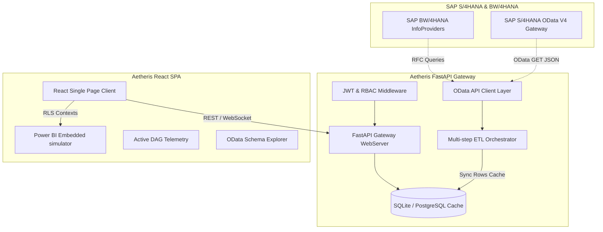

# Aetheris Enterprise Analytics Platform

[](https://github.com/kxokioo/Automating_Reporting_with_SAP_S-4HANA_and_Power-BI/actions)
[](https://www.sap.com)
[](https://powerbi.microsoft.com)
[](LICENSE)

Aetheris is a next-generation, premium enterprise analytics and reporting platform built in **2026**. It connects SAP ERP (S/4HANA OData Core V4) and enterprise warehouses (BW/4HANA Analytical Queries) to beautiful, executive-ready Power BI Embedded dashboards.

Featuring thread-safe background ETL workflows, granular Role-Based Access Control (RBAC), and an immersive HSL-tailored glassmorphic dashboard interface, Aetheris feels like a real modern enterprise SaaS product.

** SECURITY NOTE**: This codebase has been hardened with production-ready security configurations. See [SECURITY.md](SECURITY.md) for detailed security practices and [DEPLOYMENT.md](DEPLOYMENT.md) for production deployment instructions.

---

## High-Fidelity Features

- **SAP S/4HANA OData Core**: Robust Python client library implementing real OData v2/v4 HTTP endpoints with an active, highly realistic simulation seeder (`BKPF` General Ledger & `MARA` Material inventories).
- **Thread-Safe ETL Orchestrator**: Direct DAG pipeline manager in FastAPI with real-time status triggers, telemetry progress bars, and scrolling green-mono terminal logs.
- **Power BI Embedded Studio**: Authentic Microsoft Azure App-Owns-Data embedding simulator featuring widget customizers, exports, and fully interactive **Row-Level Security (RLS) testing gates**!
- **Granular RBAC Guards**: Endpoints and dashboard tiles adapt automatically depending on active user identity parameters.
- **Premium Visual Experience**: Deep-space cosmic glassmorphic aesthetics loaded with interactive Recharts SVG graphs, warning indices, and fluid animations.

---

## Platform Architecture



---

## Repository Blueprint

```
├── backend/
│   ├── app/
│   │   ├── database/        # SQLAlchemy database model layers and session injections
│   │   ├── routers/         # Authentication and executive rest endpoints
│   │   ├── services/        # SAP OData clients and multithreaded ETL engines
│   │   ├── config.py        # Pydantic BaseSettings configurations
│   │   └── main.py          # Gateway initialization and database seeding
│   ├── tests/               # Automated Pytest suite
│   ├── requirements.txt     # Python requirements
│   └── Dockerfile           # Thin Python production image
│
├── frontend/
│   ├── src/
│   │   ├── components/      # Sleek layouts and vertical navigation sidebars
│   │   ├── context/         # Auth, session credentials, and RBAC switches
│   │   ├── pages/           # Dashboard overview, ETL visualizer, OData explorer, Power BI Embed Studio
│   │   ├── App.tsx          # Card authorization login and component router
│   │   ├── index.css        # Glassmorphic utilities and custom glow animations
│   │   └── main.tsx         # Direct React bootstrap mounting
│   ├── package.json         # Node compiling configurations
│   ├── tailwind.config.js   # HSL interstellar theme rules
│   ├── nginx.conf           # SPA URL fallback serving rule
│   └── Dockerfile           # Multi-stage production compiler and Nginx image
│
├── docker-compose.yml       # Production environment deployment blueprint
└── .github/
    └── workflows/
        └── main.yml         # GitHub CI/CD validation actions
```

---

## Quick Start (Local Development)

### Prerequisites

- Node.js (v18+)
- Python (3.10+)

### 1. Launch the Backend Server

```bash
cd backend
.env.example .env
python -m venv venv
.\.venv\Scripts\Activate.ps1  # Windows: .\.venv\Scripts\Activate.ps1
python.exe -m pip install --upgrade pip
pip install -r requirements.txt
python -m uvicorn app.main:app --reload
```

_The FastAPI gateway will compile and automatically seed default identity profiles, active connections, and perform an initial ETL mock synchronization. Document logs will output directly to local terminal._

- **REST Documentation**: [http://127.0.0.1:8000/docs](http://127.0.0.1:8000/docs)

### 2. Launch the Frontend Assets

```bash
cd frontend
npm install
npm run dev
```

_The Vite hot reloading development server will launch on port 5173._

- **Application Gateway**: [http://127.0.0.1:5173](http://127.0.0.1:5173)

---

## Developer Review Credentials

Aetheris includes **Developer Review Quick Clicks** directly on the authorization card to let you log in as any role instantly. For reference, the seeded logins are:

| Username        | Pass Pin       | Role Target            | Permission Details                                                            |
| :-------------- | :------------- | :--------------------- | :---------------------------------------------------------------------------- |
| **`admin`**     | `admin123`     | **`Admin`**            | _SuperUser: Can trigger pipelines, inspect schemas, configure RLS layouts_    |
| **`finance`**   | `finance123`   | **`FinancialAnalyst`** | _FICO Clearance: Can query BKPF/BSEG OData tables, review financial Recharts_ |
| **`logistics`** | `logistics123` | **`LogisticsManager`** | _MM Clearance: Can monitor plants stocks, review lead times graphs_           |
| **`viewer`**    | `viewer123`    | **`Viewer`**           | _General Viewer: Access restricted to standard summaries_                     |

---

## Docker Deployment

To spin up the entire production cluster (including PostgreSQL, Redis caches, Nginx static proxies, and Python Uvicorn gateways), simply run:

```bash
docker-compose up --build
```

- **Aetheris Client**: [http://127.0.0.1:3000](http://127.0.0.1:3000)
- **API Server Gateway**: [http://127.0.0.1:8000](http://127.0.0.1:8000)
